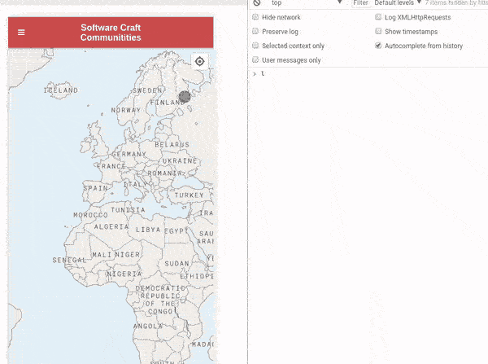

#  Software Craft Website
[](https://travis-ci.org/softwarecrafters/website) [](https://david-dm.org/softwarecrafters/website) [](https://david-dm.org/softwarecrafters/website)


The website powering [softwarecrafters.org](https://softwarecrafters.org), a website for people to find their local [Software Craft](http://manifesto.softwarecraftsmanship.org/) communities.

Feel free to fork this repository and add your local community to it.

## ⚙️ Setup

The website uses [rollup](rollupjs.org) to bundle the client-side JS and some hand-written preprocessing in order to merge and lint the [communities/*.json files](communities/). The app is integrated via [Travis](https://travis-ci.org/softwarecrafters/website) and deployed to [netlify.com](https://www.netlify.com/).

It is helpful to use [nvm](https://github.com/creationix/nvm) in order to make sure you're using the particular [node version](.nvmrc) we are using.

```
nvm install           # installs the node version we are using
npm install -g yarn   # Install yarn
yarn                  # Install dependencies

yarn build            # Build initial version
yarn watch            # Run the watch task
yarn test             # Validate the present schemata
```

## 🌐 Adding your community / conference

If you want to add your local community / conference to the map, please have a look at how the [other communities](communities/) added their community (resp. [conferences](conferences/)). There is [a JSON schema](communities_schema.json) your `community.json` is validated against through Travis (resp. for [conferences](conferences_schema.json)).

1. Fork this repository
2. Create a new file in `communities/${YOURCITYNAME}.json` (resp. `conferences/${YOURCONFERENCE}.json`)
3. Enter valid JSON as of [the schema](communities_schema.json) (resp. [conferences_schema.json](conferences_schema.json))
4. Commit & push your change
5. Create a Pull Request against this repository

### Finding the coordinates of your city...

...can be very tricky, which is why we're logging the current position of your mouse every time you click somewhere on the map.



## 🌐 Showing upcoming conferences on your conference page

A lot of the conferences listed here also list their "sibling"-conferences on their website so your attendees might be inspired to visit another conference in our communities. We highly encourage you to do that and provide a couple of ways of sourcing our data, either live or at build-time of your website:

- [`conferences.json`](https://softwarecrafters.org/conferences.json) contains all conferences (including past conferences right now).
- [`conferences.js`](https://softwarecrafters.org/conferences.js) is a `jsonp`script that will call the function `window.softwarecraft_conferences_callback` with the exact same data as is contained in `conferences.json`.
- See [`conferences_schema.json`](./conferences_schema.json) for a JSON-schema of an individual conference. The JSON will always contain an array of these.

### Example code (not tested) 

```html
<script type="application/javascript">
window.softwarecraft_conferences_callback = function(conferences) {
  console.log("Received conferences", conferences);
  for(let conference of conferences) {
    document.write(conference.name)
  }
}
</script>
<script type="application/javascript" src="https://softwarecrafters.org/conferences.js"></script>

``` 

## 👍 Contributing to the website

TBD

## 💻 3rd-party libraries used

To be documented. For the moment, have a look at our [target/vendor/](target/vendor) directory and our [package.json](package.json).

- materialize-css
- rollup
- babel
- font-awesome
- mapbox
- jquery

The logo is a remix of [🌐 from emojiOne](https://github.com/emojione/emojione/tree/2.2.7/assets) released under *Creative Commons Attribution 4.0 International* and the [Softwerkskammer Logo](https://github.com/softwerkskammer/softwerkskammer-logos) released under *Creative Commons Attribution 3.0*.
