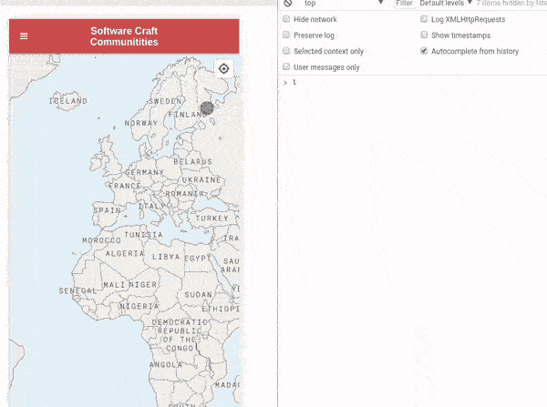

#  Software Craft Website

The website powering [softwarecrafters.org](https://softwarecrafters.org), a website for people to find their local [Software Craft](http://manifesto.softwarecraftsmanship.org/) communities.

Feel free to fork this repository and add your local community to it.

## ⚙️ Setup

The website uses [Vite](https://vite.dev/) to bundle the client-side JS and some hand-written preprocessing in order to merge and lint the [communities/\*.json files](communities/). The app is integrated and deployed via [netlify.com](https://www.netlify.com/) which detects changes.

It is helpful to use [nvm](https://github.com/creationix/nvm) in order to make sure you're using the particular [node version](.nvmrc) we are using.

```
nvm install           # installs the node version we are using
npm install           # Install dependencies

npm run build         # Build initial version
npm run watch         # Run the watch task
npm test              # Validate the present schemata
```

## 🌐 Adding your community / conference

If you want to add your local community / conference to the map, please have a look at how the [other communities](communities/) added their community (resp. [conferences](conferences/)). There is [a JSON schema](communities_schema.json) your `community.json` is validated against through the build system (resp. for [conferences](conferences_schema_v2.json)).

1. Fork this repository
2. Create a new file in `communities/${YOURCITYNAME}.json` (resp. `conferences/${YOURCONFERENCE}.json`)
3. Enter valid JSON as of [the schema](communities_schema.json) (resp. [conferences_schema_v2.json](conferences_schema_v2.json))
4. Commit & push your change
5. Create a Pull Request against this repository

### Finding the coordinates of your city



Coordinates can be looked up quickly using map tools (for example OpenStreetMap or Google Maps) by right-clicking a point and copying latitude/longitude.

## 🌐 Showing upcoming conferences on your conference page

A lot of the conferences listed here also list their "sibling"-conferences on their website so your attendees might be inspired to visit another conference in our communities. We highly encourage you to do that and provide a couple of ways of sourcing our data, either live or at build-time of your website:

- [`conferences.json`](https://softwarecrafters.org/conferences.json) contains all conferences (including past conferences right now).
- [`conferences.js`](https://softwarecrafters.org/conferences.js) is a `jsonp` script that will call the function `window.softwarecraft_conferences_callback` with the exact same data as is contained in `conferences.json`.
- See [`conferences_schema_v2.json`](./conferences_schema_v2.json) for a JSON-schema of an individual conference. The JSON will always contain an array of these.

### Example code (not tested)

```html
<script type="application/javascript">
  window.softwarecraft_conferences_callback = function (conferences) {
    console.log('Received conferences', conferences);
    for (let conference of conferences) {
      document.write(conference.name);
    }
  };
</script>
<script type="application/javascript" src="https://softwarecrafters.org/conferences.js"></script>
```

## 👍 Contributing to the website

Contributions are welcome.

1. Fork the repository
2. Create a feature branch
3. Run `npm test` and `npm run build`
4. Open a pull request

## 💻 3rd-party libraries used

This project uses npm packages for dependency management, while some browser assets are committed to [static/vendor/](static/vendor) and referenced directly in HTML.

- Source packages (managed via npm):
  - [@fortawesome/fontawesome-free](https://www.npmjs.com/package/@fortawesome/fontawesome-free)
  - [mapbox-gl](https://www.npmjs.com/package/mapbox-gl)
  - [@mapbox/mapbox-gl-geocoder](https://www.npmjs.com/package/@mapbox/mapbox-gl-geocoder)
- Runtime references:
  - [index.html](index.html) and [conferences.html](conferences.html) load `./vendor/...` assets from [static/vendor/](static/vendor)
  - application JS/CSS is bundled with Vite

When updating vendor-source packages, copy the needed built assets from `node_modules` into [static/vendor/](static/vendor), then run `npm test` and `npm run build`.

- vite
- babel
- @fortawesome/fontawesome-free
- mapbox
- @mapbox/mapbox-gl-geocoder

The logo is a remix of [🌐 from emojiOne](https://github.com/emojione/emojione/tree/2.2.7/assets) released under _Creative Commons Attribution 4.0 International_ and the [Softwerkskammer Logo](https://github.com/softwerkskammer/softwerkskammer-logos) released under _Creative Commons Attribution 3.0_.
